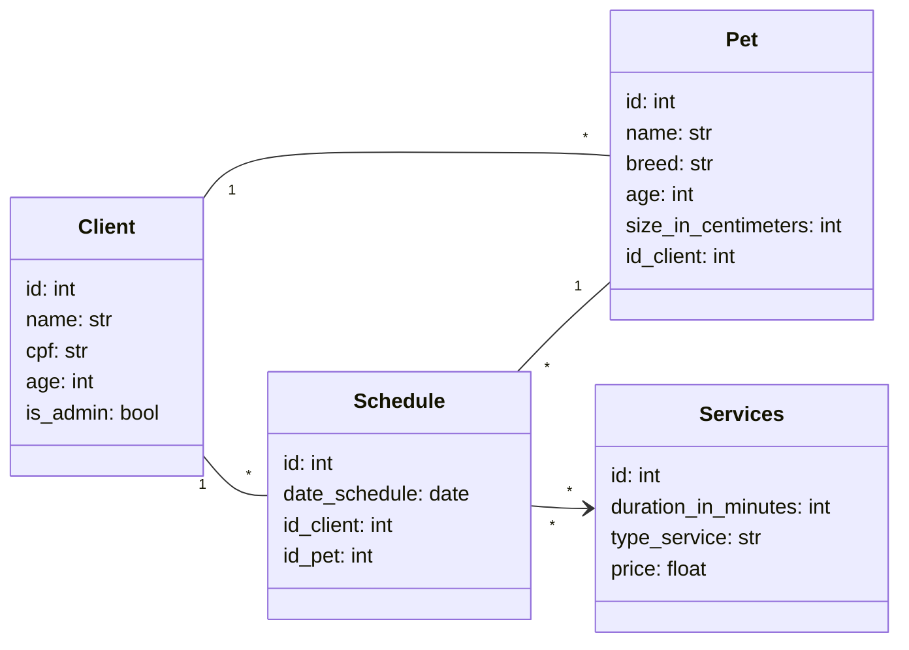

```mermaid
classDiagram
    direction LR
    class Client {
        id: int 
        name: str
        cpf: str
        age: int
        is_admin: bool
    }

    class Pet {
        id: int
        name: str
        breed: str
        age: int
        size_in_centimeters: int
        id_client: int
    }

    class Schedule {
        id: int
        date_schedule: date
        id_client: int
        id_pet: int
    }

    class Services {
        id: int
        duration_in_minutes: int
        type_service: str
        price: float
    }

    Client "1" -- "*" Pet
    Client "1" -- "*" Schedule
    Schedule "*" --> "*" Services
    Schedule "*" -- "1" Pet
``` 
